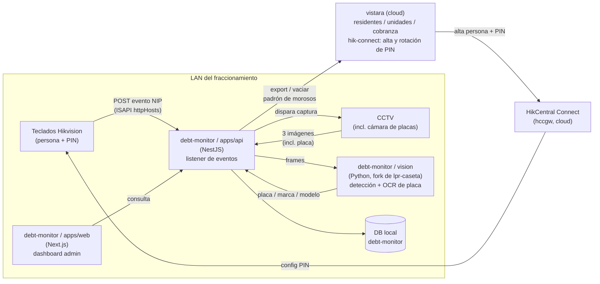

# Arquitectura general

## Panorama de componentes



Puntos clave de este diagrama:

- **`debt-monitor` corre en la LAN**, no en la nube — es requisito, porque
  necesita alcanzar tanto los teclados como el CCTV en tiempo real. Ver
  [Hallazgos Hikvision](hallazgos-hikvision.md) para por qué la vía cloud
  (`hccgw`) no sirve para este propósito.
- **La emisión/rotación del PIN es responsabilidad de `vistara`**, no de
  este proyecto. `vistara/apps/api/src/hik-connect/` ya tiene
  `hik-connect-roster.service.ts` y `hik-connect-rotation.service.ts`
  hablando con `hccgw`. `debt-monitor` solo consume el hecho de que un PIN
  fue usado — no gestiona altas ni rotación.
- **`debt-monitor` es un satélite que alimenta a `vistara`**, no lo
  reemplaza ni se fusiona con él en vivo. El flujo es: capturar y auditar
  acá, y periódicamente "vaciar" el padrón de vehículo↔domicilio↔PIN hacia
  `vistara` (mecanismo exacto de export — API vs. batch — pendiente de
  decidir cuando lleguemos a esa fase).
- **El OCR de placa no se escribe desde cero** — se evalúa reusar/adaptar
  `lpr-caseta` (Python, ya resuelve detección de vehículo + OCR) como
  servicio hermano dentro del mismo repo, invocado por `apps/api`.

## Retención de datos (decidido, pendiente de implementar)

Decisión del usuario (2026-08-22): **ventana rodante de 1 año**, tanto
para los eventos crudos como para su forma parseada. Aplica en dos
niveles distintos:

- **Ruido (puerta abrió/cerró, videoloss, excepciones de red/voltaje,
  etc.)** — no se persiste en absoluto, ni crudo ni parseado. Se descarta
  en el momento de recibir el `POST`, antes de tocar disco o DB (ver
  criterio de filtrado — sección "`capabilities` no documenta bien..." en
  [Hallazgos Hikvision](hallazgos-hikvision.md)).
- **Cruces reales (`AccessControllerEvent` con identidad)** — sí se
  guardan, en dos formas que expiran juntas a 1 año:
  - El registro parseado en la tabla `AccessEvent` (Fase 2) — la fuente
    de verdad para consultas/auditoría.
  - El `.raw` original como respaldo — útil para reprocesar si el parser
    tenía un bug, no para consultar directamente.

**Mecanismo de purga:** un job semanal que borra ambas cosas (fila de DB
+ `.raw` asociado) con más de 1 año de antigüedad. Debe vivir **dentro de
`apps/api`** cuando exista (cron interno de la app, o cron del sistema
donde corra) — no es algo que deba depender de una sesión de Claude Code,
que es efímera.

Mientras no exista `apps/api`, los `.raw` de prueba en
`tools/httphosts-probe/captures/` no tienen todavía un mecanismo de purga
automático — se limpian manualmente cuando haga falta (ver
[Fase 1](fase1-recepcion-eventos.md) por cómo se comprimieron los del
2026-08-22).

## Layout del monorepo (decidido, pendiente de scaffold)

Mismo patrón que `vistara` (pnpm + Turborepo, `apps/*` + `libs/*`) por
consistencia entre proyectos hermanos:

```
debt-monitor/
  developersDocs/        # este mkdocs
  docs/hikvision/         # manuales oficiales (ISAPI, hccgw OpenAPI)
  tools/httphosts-probe/  # herramienta de prueba de Fase 1 (ver fase1-recepcion-eventos.md)
  apps/
    api/                  # NestJS — listener de eventos, orquesta capturas CCTV, DB, export a vistara
    web/                  # Next.js — dashboard admin (mismo stack que vistara/apps/web)
    vision/                # Python (fork/adaptación de lpr-caseta) — detección + OCR de placa
  libs/
    prisma/                # schema/cliente compartido (a definir si comparte DB con vistara o es propia)
  pnpm-workspace.yaml
  turbo.json
```

`apps/web` queda confirmado en **Next.js** (React), igual que
`vistara/apps/web`, en vez de Angular — decisión tomada explícitamente
para mantener consistencia entre los dos proyectos hermanos.

Este layout todavía no está scaffoldeado — se arma cuando cerremos
Fase 1 (recepción de eventos) y tengamos claro el shape real del payload
del evento, para no adivinar el modelo de datos antes de tiempo.

## Operación: los 3 servicios corren como servicio de Windows (2026-08-23)

`apps/api` (9100), `apps/web` (3000) y `tools/plate-reader` (9300) corren
en producción como servicios de Windows via **NSSM**, mismo patrón que
`lpr-caseta` (`lpr-ocr`/`lpr-web`/`lpr-stream`). Se hizo el cambio porque
correrlos a mano (`node dist/main.js`, `next start`, `python service.py`)
los deja atados al ciclo de vida de la sesión de Claude Code que los
lanzó — un límite de contexto, un reinicio de sesión, o cualquier evento
de harness los mata sin que la app tenga ningún bug. Eso pasó de verdad:
`apps/api` estuvo caído ~50 min sin que nadie se diera cuenta hasta que el
usuario reportó "no veo cruces nuevos" (2026-08-23).

Nombres de servicio: `debt-api`, `debt-web`, `debt-plate-reader`. Config
de cada uno (vía `nssm install` + `nssm set`), igual a la de `lpr-ocr`:

| Servicio | Ejecutable | AppParameters | AppDirectory |
|---|---|---|---|
| `debt-api` | `node.exe` | `dist\main.js` | `apps\api` (así carga su `.env` propio, `ConfigModule.forRoot()` resuelve relativo a `process.cwd()`) |
| `debt-web` | `node.exe` | `node_modules\next\dist\bin\next start` | `apps\web` |
| `debt-plate-reader` | `lpr-caseta\.venv\Scripts\python.exe` | `service.py 9300` | `tools\plate-reader` |

En los 3: `AppExit Default Restart` (Windows lo relanza solo si se cae),
`Start SERVICE_AUTO_START` (arrancan solos al prender la PC), `ObjectName
LocalSystem`, logs con rotación en `logs/*.{out,err}.log`
(`AppRotateFiles 1`, `AppRotateBytes 10485760`).

**Administrarlos:** `nssm start|stop|restart <nombre>`, o
`Get-Service debt-*` / `Restart-Service debt-api` desde PowerShell. El
ejecutable de `nssm` en esta máquina está en
`C:\Users\lares\AppData\Local\Microsoft\WinGet\Links\nssm.exe`.

**Nota sobre `NEXT_PUBLIC_API_URL`:** ese env var se hornea en el build de
producción de `apps/web` (`next build`), no se lee en runtime — por eso el
servicio `debt-web` no necesita `AppEnvironmentExtra`, solo correr el
build ya hecho.
