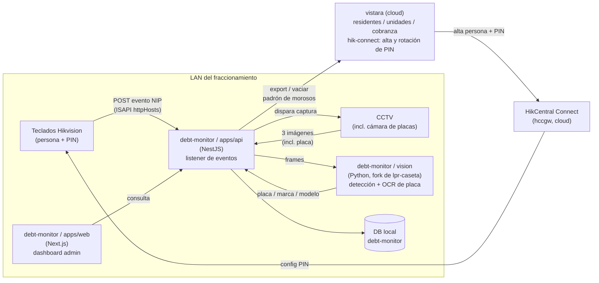

# Arquitectura general

## Panorama de componentes



Puntos clave de este diagrama:

- **`debt-monitor` corre en la LAN**, no en la nube — es requisito, porque
  necesita alcanzar tanto los teclados como el CCTV en tiempo real. Ver
  [Hallazgos Hikvision](hallazgos-hikvision.md) para por qué la vía cloud
  (`hccgw`) no sirve para este propósito.
- **La emisión/rotación del PIN es responsabilidad de `vistara`**, no de
  este proyecto. `vistara/apps/api/src/hik-connect/` ya tiene
  `hik-connect-roster.service.ts` y `hik-connect-rotation.service.ts`
  hablando con `hccgw`. `debt-monitor` solo consume el hecho de que un PIN
  fue usado — no gestiona altas ni rotación.
- **`debt-monitor` es un satélite que alimenta a `vistara`**, no lo
  reemplaza ni se fusiona con él en vivo. El flujo es: capturar y auditar
  acá, y periódicamente "vaciar" el padrón de vehículo↔domicilio↔PIN hacia
  `vistara` (mecanismo exacto de export — API vs. batch — pendiente de
  decidir cuando lleguemos a esa fase).
- **El OCR de placa no se escribe desde cero** — se evalúa reusar/adaptar
  `lpr-caseta` (Python, ya resuelve detección de vehículo + OCR) como
  servicio hermano dentro del mismo repo, invocado por `apps/api`.

## Layout del monorepo (decidido, pendiente de scaffold)

Mismo patrón que `vistara` (pnpm + Turborepo, `apps/*` + `libs/*`) por
consistencia entre proyectos hermanos:

```
debt-monitor/
  developersDocs/        # este mkdocs
  docs/hikvision/         # manuales oficiales (ISAPI, hccgw OpenAPI)
  tools/httphosts-probe/  # herramienta de prueba de Fase 1 (ver fase1-recepcion-eventos.md)
  apps/
    api/                  # NestJS — listener de eventos, orquesta capturas CCTV, DB, export a vistara
    web/                  # Next.js — dashboard admin (mismo stack que vistara/apps/web)
    vision/                # Python (fork/adaptación de lpr-caseta) — detección + OCR de placa
  libs/
    prisma/                # schema/cliente compartido (a definir si comparte DB con vistara o es propia)
  pnpm-workspace.yaml
  turbo.json
```

`apps/web` queda confirmado en **Next.js** (React), igual que
`vistara/apps/web`, en vez de Angular — decisión tomada explícitamente
para mantener consistencia entre los dos proyectos hermanos.

Este layout todavía no está scaffoldeado — se arma cuando cerremos
Fase 1 (recepción de eventos) y tengamos claro el shape real del payload
del evento, para no adivinar el modelo de datos antes de tiempo.
