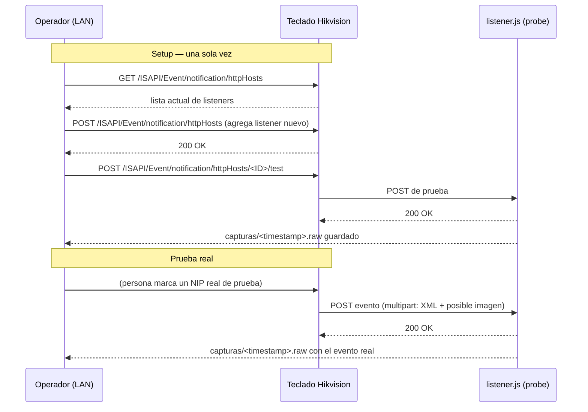

# Fase 1 — Recepción de eventos

Objetivo: probar que se puede enganchar al push HTTP local de los
teclados (`ISAPI Event/notification/httpHosts`, ver
[Hallazgos Hikvision](hallazgos-hikvision.md)) y capturar el evento real
que dispara un teclado cuando alguien marca un NIP.

Herramienta: [`tools/httphosts-probe/`](../../tools/httphosts-probe/)
(código + runbook operativo de copiar/pegar). Este documento es la
narrativa completa; el `README.md` de esa carpeta es la versión corta
para tenerla abierta en terminal mientras se ejecuta.

## Flujo completo

## Estado — validado hasta ahora

- ✅ `listener.js` (cero dependencias, Node) recibe y guarda en crudo
  ambos formatos que documenta el manual: body XML plano, y multipart
  con `Event_Type` + `Picture_Name` (imagen binaria). Validado localmente
  con requests sintéticos (`curl`), sin tocar ningún teclado real.
- ✅ `GET /ISAPI/Event/notification/httpHosts` corrido contra un teclado
  real de este sitio: la lista tiene 2 slots, ambos en estado default
  (`ipAddress 0.0.0.0`, `portNo 0`, sin `url`) — **no hay nada de iVMS-4200
  ahí**, confirma que iVMS-4200 usa modo armado (`alertStream`), no
  `httpHosts` (detalle completo en
  [Hallazgos Hikvision](hallazgos-hikvision.md)). No hay riesgo de pisar
  una integración existente al agregar nuestro listener.
- ✅ Confirmado que el port-forwarding que ya tiene el usuario hacia su
  laptop deja pasar tráfico teclado→cliente (porque así recibe iVMS-4200
  sus notificaciones ahí) — buena señal de que el mismo camino de red
  puede servir para nuestro propio listener, sin necesidad de estar
  físicamente en la LAN.
- ⏳ Pendiente: correr el `POST` de alta + `test` + capturar un evento
  real (NIP real de prueba) — **se hace en LAN**, ver
  [plan de repo/entorno](fases.md#fase-1-recepcion-de-eventos-en-progreso)
  en Fases del proyecto.

## Regla de seguridad (repetida a propósito)

`PUT /ISAPI/Event/notification/httpHosts` reemplaza **toda** la lista.
Siempre `GET` primero, siempre agregar con `POST`. Nunca `PUT` a menos
que sea con la lista completa vista en el `GET`, a propósito.

## Manejo de credenciales

Las credenciales admin de los teclados **no se comitean**. El runbook en
`tools/httphosts-probe/README.md` usa placeholders
(`<ADMIN_USER>`, `<ADMIN_PASS>`, `<KEYPAD_IP>`) — llenarlos solo en la
terminal al momento de ejecutar, o en un archivo local no trackeado
(ver `.gitignore` en la raíz).

## Próximos pasos concretos

1. Clonar/copiar el repo en una máquina dentro de la LAN de los teclados
   (o vía VPN, si se confirma que soporta el tráfico en ambos sentidos).
2. Seguir `tools/httphosts-probe/README.md` paso a paso: GET → POST alta
   → POST test → NIP real de prueba.
3. Traer de vuelta el `.raw` capturado del evento real.
4. Con eso, pasar a
   [Fase 2 — Parseo real del evento](fases.md#fase-2-parseo-real-del-evento-modelo-de-datos).
